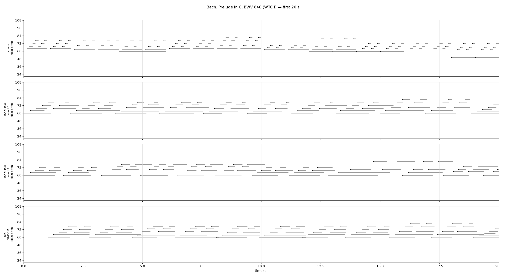
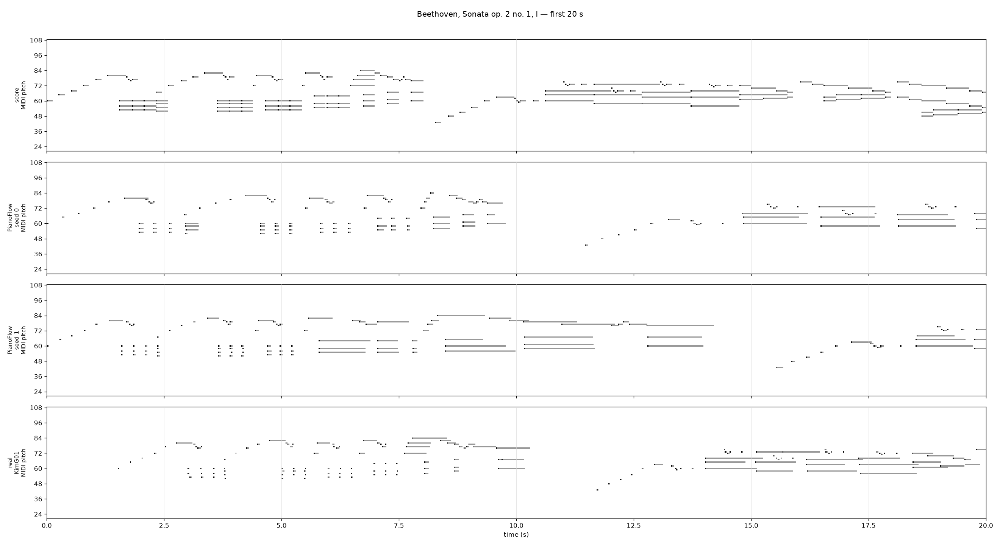
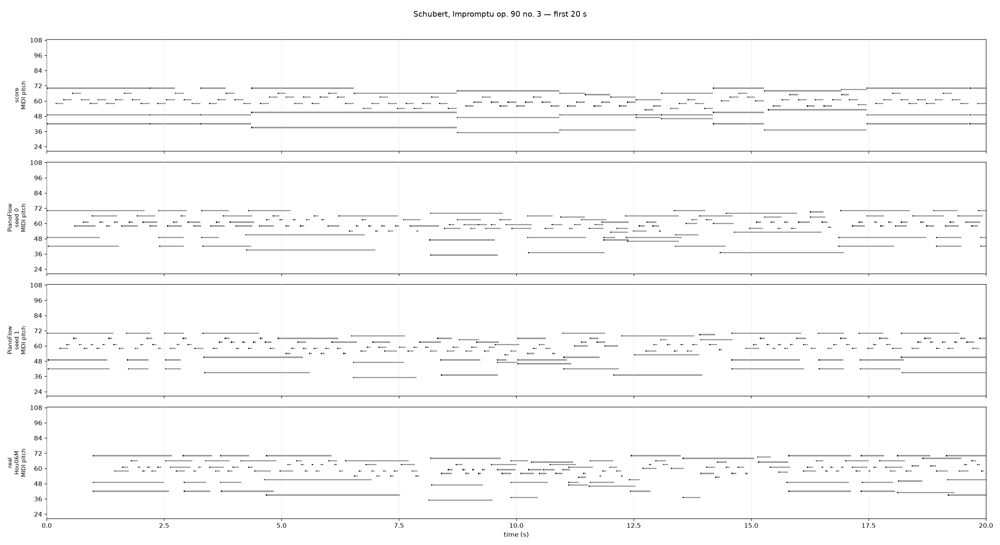
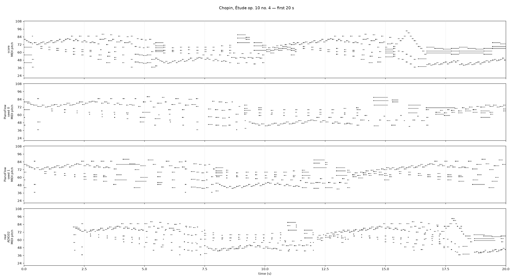
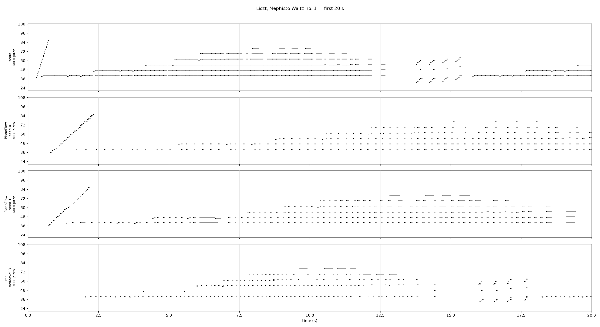

# PianoFlow renders (pilot, 2026-09-28)

PianoFlow (SyMuPe, PianoFlow-base, 24.5 M parameters, flow matching over beat-relative deviations, trained on PianoCoRe-A) renders a quantised score MIDI into a performance MIDI with the same notes one-to-one, changing onsets, durations and velocities and adding sustain as lengthened durations. There is no tempo, guidance or temperature control in the public API: the model samples its own global tempo, and seed is the only diversity knob besides the number of flow steps. Each piece below is the full ASAP score MIDI, three seeds (0, 1, 2; 10 flow steps) and one real ASAP performance. The tempo plot shows beats per minute per score beat for the three renders and the real performance.

| piece | notes | score MIDI dur (s) | seed 0 dur (s) | seed 1 dur (s) | seed 2 dur (s) | real dur (s) | seed vel mean / std | real vel mean / std |
|---|---:|---:|---:|---:|---:|---:|---:|---:|
| Bach, Prelude in C, BWV 846 (WTC I) | 549 | 70.0 | 148.6 | 135.5 | 124.7 | 139.1 | 50.1 / 6.7 | 53.6 / 12.1 |
| Beethoven, Sonata op. 2 no. 1, I | 1683 | 156.6 | 193.7 | 174.2 | 164.7 | 164.2 | 64.6 / 12.2 | 68.9 / 15.3 |
| Schubert, Impromptu op. 90 no. 3 | 2942 | 375.3 | 535.2 | 507.0 | 587.3 | 320.3 | 51.1 / 12.6 | 48.8 / 15.0 |
| Chopin, Étude op. 10 no. 4 | 2239 | 112.2 | 174.6 | 152.2 | 147.0 | 115.1 | 70.9 / 9.1 | 74.9 / 11.1 |
| Liszt, Mephisto Waltz no. 1 | 10233 | 605.1 | 1037.2 | 838.0 | 782.3 | 669.3 | 74.2 / 14.1 | 68.7 / 19.3 |

Durations are the last note offset. Velocity of the seeds is the mean over the three seeds of per-file mean / std.

## Bach, Prelude in C, BWV 846 (WTC I)

Folder [`bach_prelude_bwv846/`](bach_prelude_bwv846/): `score.mid`, `sample_00..02.mid` (+ `_sus`), `performance.mid` (ASAP Shi05M), `stats.txt`.

Tempo: beats per minute per score quarter, 60 / diff of the performed times of consecutive quarters; seeds from the render's beat times, real (Shi05M) from the ASAP beat annotations mapped to score quarters through the score MIDI's tempo map and interpolated at every quarter. No smoothing.

## Beethoven, Sonata op. 2 no. 1, I

Folder [`beethoven_op2no1_mv1/`](beethoven_op2no1_mv1/): `score.mid`, `sample_00..02.mid` (+ `_sus`), `performance.mid` (ASAP KimG01), `stats.txt`.

Tempo: beats per minute per score quarter, 60 / diff of the performed times of consecutive quarters; seeds from the render's beat times, real (KimG01) from the ASAP beat annotations mapped to score quarters through the score MIDI's tempo map and interpolated at every quarter. No smoothing.

## Schubert, Impromptu op. 90 no. 3

Folder [`schubert_op90no3/`](schubert_op90no3/): `score.mid`, `sample_00..02.mid` (+ `_sus`), `performance.mid` (ASAP Hou06M), `stats.txt`.

Tempo: beats per minute per score quarter, 60 / diff of the performed times of consecutive quarters; seeds from the render's beat times, real (Hou06M) from the ASAP beat annotations mapped to score quarters through the score MIDI's tempo map and interpolated at every quarter. No smoothing.

## Chopin, Étude op. 10 no. 4

Folder [`chopin_op10no4/`](chopin_op10no4/): `score.mid`, `sample_00..02.mid` (+ `_sus`), `performance.mid` (ASAP ADIG02), `stats.txt`.

Tempo: beats per minute per score quarter, 60 / diff of the performed times of consecutive quarters; seeds from the render's beat times, real (ADIG02) from the ASAP beat annotations mapped to score quarters through the score MIDI's tempo map and interpolated at every quarter. No smoothing.

## Liszt, Mephisto Waltz no. 1

Folder [`liszt_mephisto/`](liszt_mephisto/): `score.mid`, `sample_00..02.mid` (+ `_sus`), `performance.mid` (ASAP Avdeeva03), `stats.txt`.

Tempo: beats per minute per score quarter, 60 / diff of the performed times of consecutive quarters; seeds from the render's beat times, real (Avdeeva03) from the ASAP beat annotations mapped to score quarters through the score MIDI's tempo map and interpolated at every quarter. No smoothing.

## Diversity on Chopin op. 10 no. 4

Eight seeds on Chopin op. 10 no. 4 versus its 22 real ASAP performances, on the common 326-beat grid. Tempo = centred log beat period, dynamics = centred mean velocity per beat window; RMS over beats, averaged over pairs. Renders are 1.3–1.6× slower than the real performances and their global tempo spread (CV 0.19) is four times the real one (0.05); local tempo-curve diversity between seeds (0.129) exceeds the real inter-performer diversity (0.095); dynamics diversity is below it (6.6 vs 8.2). The real-versus-render distance (0.138 / 9.3) is above both within-group values, so renders are separable from real performances. The step-factor knob does not reach the model in symupe 1.1.0 (the two factor rows equal the default at n = 4).

| group | n | duration mean (s) ± CV | tempo pairwise RMS | dynamics pairwise RMS | micro-timing std (ms) |
|---|---:|---:|---:|---:|---:|
| real (22 perfs) | 22 | 116.5 ± 0.049 | 0.095 | 8.24 | - |
| default | 8 | 170.5 ± 0.187 | 0.129 | 6.64 | 11.2 |
| factor0.5 | 4 | 177.3 ± 0.256 | 0.167 | 5.75 | 11.6 |
| factor1.0 | 4 | 177.3 ± 0.256 | 0.167 | 5.75 | 11.6 |
| steps32 | 4 | 186.8 ± 0.228 | 0.262 | 7.76 | 24.8 |
| steps4 | 4 | 165.4 ± 0.218 | 0.123 | 3.92 | 7.7 |

| condition | tempo RMS real↔cond | dynamics RMS real↔cond |
|---|---:|---:|
| default | 0.138 | 9.26 |
| factor0.5 | 0.152 | 9.13 |
| factor1.0 | 0.152 | 9.13 |
| steps32 | 0.196 | 9.13 |
| steps4 | 0.147 | 8.89 |
