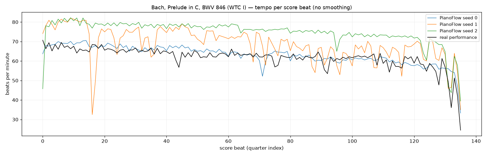
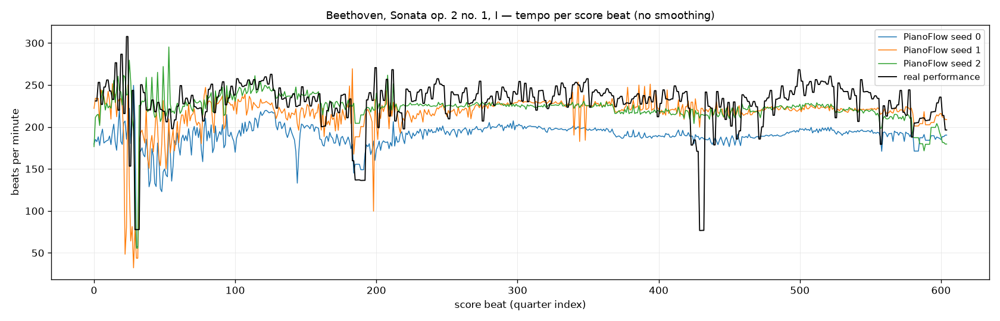
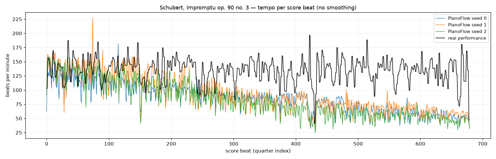
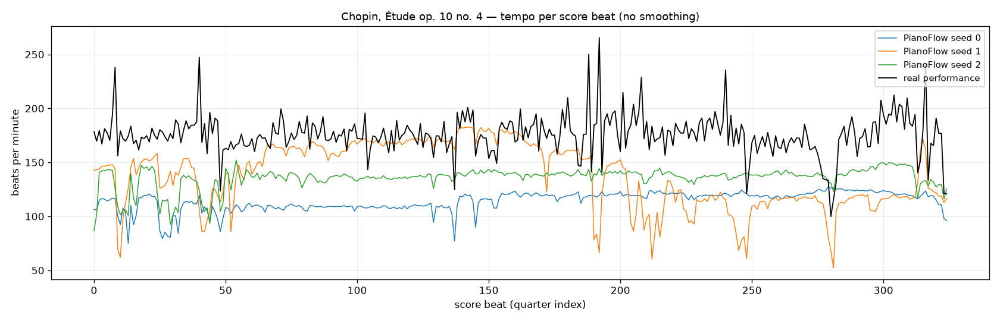
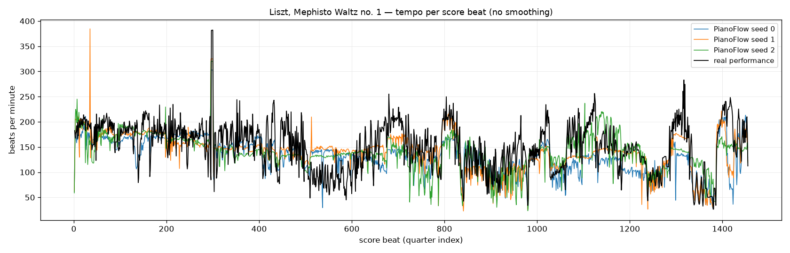

# PianoFlow vs PianistTransformer (pilot, 2026-09-28)

Two public score-to-performance renderers on the same five ASAP score MIDIs, beside one real ASAP performance each. PianoFlow (SyMuPe, PianoFlow-base, 24.5 M, flow matching over beat-relative deviations, trained on PianoCoRe-A) keeps the notes one-to-one, writes sustain as lengthened durations, and is steered by the score's tempo marking once our wrapper forwards the score tokens that the released package drops; seed and the number of flow steps are its diversity knobs. PianistTransformer (135 M encoder–decoder, T5Gemma backbone, temperature 1.0 / top-p 0.95) emits the score's pitches in order in absolute time, writes pedal as CC64, runs long pieces in overlapping windows, and drops zero-length duplicate score notes. Audio is prerendered (Salamander grand, first 120 s of each track, mono MP3) and played by one shared player docked at the bottom; full-length MIDI files are linked under each piece. The tempo plot shows beats per minute per score quarter for the three renders of each model and the real performance.

| piece | notes (score / PT input) | score MIDI (s) | PianoFlow (s) ×3 | PianistTransformer (s) ×3 | real (s) | PF vel mean / std | PT vel mean / std | real vel mean / std |
|---|---:|---:|---:|---:|---:|---:|---:|---:|
| Bach, Prelude in C, BWV 846 (WTC I) | 549 / 549 | 70.0 | 138.0 / 128.2 / 117.4 | 123.3 / 83.8 / 116.6 | 139.1 | 51.1 / 6.8 | 67.1 / 8.1 | 53.6 / 12.1 |
| Beethoven, Sonata op. 2 no. 1, I | 1683 / 1683 | 156.6 | 173.5 / 166.1 / 157.0 | 147.6 / 139.9 / 138.0 | 164.2 | 65.9 / 11.9 | 69.3 / 12.8 | 68.9 / 15.3 |
| Schubert, Impromptu op. 90 no. 3 | 2942 / 2768 | 375.3 | 500.0 / 492.8 / 554.8 | 261.8 / 265.4 / 243.9 | 320.3 | 51.6 / 12.8 | 57.4 / 13.7 | 48.8 / 15.0 |
| Chopin, Étude op. 10 no. 4 | 2239 / 2208 | 112.2 | 139.3 / 131.1 / 123.8 | 114.9 / 115.5 / 116.0 | 115.1 | 70.8 / 10.1 | 72.1 / 11.5 | 74.9 / 11.1 |
| Liszt, Mephisto Waltz no. 1 | 10233 / 10177 | 605.1 | 731.1 / 695.4 / 685.7 | 539.2 / 528.4 / 515.0 | 669.3 | 75.9 / 12.7 | 74.7 / 15.2 | 68.7 / 19.3 |

Durations are the last note offset. Velocity per model is the mean over its three renders of per-file mean / std.

Global tempo: PianoFlow 0.92–1.14× the real duration on four pieces and 1.6× on Schubert op. 90/3; PianistTransformer 0.77–1.0× everywhere, with Schubert and Liszt at about 0.8× and one Bach sample (84 s) far faster than its siblings.

## Bach, Prelude in C, BWV 846 (WTC I)

Folder [`bach_prelude_bwv846/`](bach_prelude_bwv846/), with `stats.txt`.

- Reference (audio): [Score](bach_prelude_bwv846/score.mp3), [Real performance (Shi05M)](bach_prelude_bwv846/performance.mp3)
- PianoFlow (audio): [seed 0](bach_prelude_bwv846/pf_0.mp3), [seed 1](bach_prelude_bwv846/pf_1.mp3), [seed 2](bach_prelude_bwv846/pf_2.mp3)
- PianistTransformer (audio): [sample 0](bach_prelude_bwv846/pt_0.mp3), [sample 1](bach_prelude_bwv846/pt_1.mp3), [sample 2](bach_prelude_bwv846/pt_2.mp3)
- MIDI: [score](bach_prelude_bwv846/score.mid), [real (Shi05M)](bach_prelude_bwv846/performance.mid), [PF seed 0](bach_prelude_bwv846/sample_00.mid), [(+sus)](bach_prelude_bwv846/sample_00_sus.mid), [PF seed 1](bach_prelude_bwv846/sample_01.mid), [(+sus)](bach_prelude_bwv846/sample_01_sus.mid), [PF seed 2](bach_prelude_bwv846/sample_02.mid), [(+sus)](bach_prelude_bwv846/sample_02_sus.mid), [PT 0](bach_prelude_bwv846/pt_00.mid), [PT 1](bach_prelude_bwv846/pt_01.mid), [PT 2](bach_prelude_bwv846/pt_02.mid)

Tempo: beats per minute per score quarter, 60 / diff of the performed times of consecutive quarters; renders from their beat times, real (Shi05M) from the ASAP beat annotations mapped to score quarters through the score MIDI's tempo map and interpolated at every quarter. No smoothing.

## Beethoven, Sonata op. 2 no. 1, I

Folder [`beethoven_op2no1_mv1/`](beethoven_op2no1_mv1/), with `stats.txt`.

- Reference (audio): [Score](beethoven_op2no1_mv1/score.mp3), [Real performance (KimG01)](beethoven_op2no1_mv1/performance.mp3)
- PianoFlow (audio): [seed 0](beethoven_op2no1_mv1/pf_0.mp3), [seed 1](beethoven_op2no1_mv1/pf_1.mp3), [seed 2](beethoven_op2no1_mv1/pf_2.mp3)
- PianistTransformer (audio): [sample 0](beethoven_op2no1_mv1/pt_0.mp3), [sample 1](beethoven_op2no1_mv1/pt_1.mp3), [sample 2](beethoven_op2no1_mv1/pt_2.mp3)
- MIDI: [score](beethoven_op2no1_mv1/score.mid), [real (KimG01)](beethoven_op2no1_mv1/performance.mid), [PF seed 0](beethoven_op2no1_mv1/sample_00.mid), [(+sus)](beethoven_op2no1_mv1/sample_00_sus.mid), [PF seed 1](beethoven_op2no1_mv1/sample_01.mid), [(+sus)](beethoven_op2no1_mv1/sample_01_sus.mid), [PF seed 2](beethoven_op2no1_mv1/sample_02.mid), [(+sus)](beethoven_op2no1_mv1/sample_02_sus.mid), [PT 0](beethoven_op2no1_mv1/pt_00.mid), [PT 1](beethoven_op2no1_mv1/pt_01.mid), [PT 2](beethoven_op2no1_mv1/pt_02.mid)

Tempo: beats per minute per score quarter, 60 / diff of the performed times of consecutive quarters; renders from their beat times, real (KimG01) from the ASAP beat annotations mapped to score quarters through the score MIDI's tempo map and interpolated at every quarter. No smoothing.

## Schubert, Impromptu op. 90 no. 3

Folder [`schubert_op90no3/`](schubert_op90no3/), with `stats.txt`.

- Reference (audio): [Score](schubert_op90no3/score.mp3), [Real performance (Hou06M)](schubert_op90no3/performance.mp3)
- PianoFlow (audio): [seed 0](schubert_op90no3/pf_0.mp3), [seed 1](schubert_op90no3/pf_1.mp3), [seed 2](schubert_op90no3/pf_2.mp3)
- PianistTransformer (audio): [sample 0](schubert_op90no3/pt_0.mp3), [sample 1](schubert_op90no3/pt_1.mp3), [sample 2](schubert_op90no3/pt_2.mp3)
- MIDI: [score](schubert_op90no3/score.mid), [real (Hou06M)](schubert_op90no3/performance.mid), [PF seed 0](schubert_op90no3/sample_00.mid), [(+sus)](schubert_op90no3/sample_00_sus.mid), [PF seed 1](schubert_op90no3/sample_01.mid), [(+sus)](schubert_op90no3/sample_01_sus.mid), [PF seed 2](schubert_op90no3/sample_02.mid), [(+sus)](schubert_op90no3/sample_02_sus.mid), [PT 0](schubert_op90no3/pt_00.mid), [PT 1](schubert_op90no3/pt_01.mid), [PT 2](schubert_op90no3/pt_02.mid)

Tempo: beats per minute per score quarter, 60 / diff of the performed times of consecutive quarters; renders from their beat times, real (Hou06M) from the ASAP beat annotations mapped to score quarters through the score MIDI's tempo map and interpolated at every quarter. No smoothing.

## Chopin, Étude op. 10 no. 4

Folder [`chopin_op10no4/`](chopin_op10no4/), with `stats.txt`.

- Reference (audio): [Score](chopin_op10no4/score.mp3), [Real performance (ADIG02)](chopin_op10no4/performance.mp3)
- PianoFlow (audio): [seed 0](chopin_op10no4/pf_0.mp3), [seed 1](chopin_op10no4/pf_1.mp3), [seed 2](chopin_op10no4/pf_2.mp3)
- PianistTransformer (audio): [sample 0](chopin_op10no4/pt_0.mp3), [sample 1](chopin_op10no4/pt_1.mp3), [sample 2](chopin_op10no4/pt_2.mp3)
- MIDI: [score](chopin_op10no4/score.mid), [real (ADIG02)](chopin_op10no4/performance.mid), [PF seed 0](chopin_op10no4/sample_00.mid), [(+sus)](chopin_op10no4/sample_00_sus.mid), [PF seed 1](chopin_op10no4/sample_01.mid), [(+sus)](chopin_op10no4/sample_01_sus.mid), [PF seed 2](chopin_op10no4/sample_02.mid), [(+sus)](chopin_op10no4/sample_02_sus.mid), [PT 0](chopin_op10no4/pt_00.mid), [PT 1](chopin_op10no4/pt_01.mid), [PT 2](chopin_op10no4/pt_02.mid)

Tempo: beats per minute per score quarter, 60 / diff of the performed times of consecutive quarters; renders from their beat times, real (ADIG02) from the ASAP beat annotations mapped to score quarters through the score MIDI's tempo map and interpolated at every quarter. No smoothing.

## Liszt, Mephisto Waltz no. 1

Folder [`liszt_mephisto/`](liszt_mephisto/), with `stats.txt`.

- Reference (audio): [Score](liszt_mephisto/score.mp3), [Real performance (Avdeeva03)](liszt_mephisto/performance.mp3)
- PianoFlow (audio): [seed 0](liszt_mephisto/pf_0.mp3), [seed 1](liszt_mephisto/pf_1.mp3), [seed 2](liszt_mephisto/pf_2.mp3)
- PianistTransformer (audio): [sample 0](liszt_mephisto/pt_0.mp3), [sample 1](liszt_mephisto/pt_1.mp3), [sample 2](liszt_mephisto/pt_2.mp3)
- MIDI: [score](liszt_mephisto/score.mid), [real (Avdeeva03)](liszt_mephisto/performance.mid), [PF seed 0](liszt_mephisto/sample_00.mid), [(+sus)](liszt_mephisto/sample_00_sus.mid), [PF seed 1](liszt_mephisto/sample_01.mid), [(+sus)](liszt_mephisto/sample_01_sus.mid), [PF seed 2](liszt_mephisto/sample_02.mid), [(+sus)](liszt_mephisto/sample_02_sus.mid), [PT 0](liszt_mephisto/pt_00.mid), [PT 1](liszt_mephisto/pt_01.mid), [PT 2](liszt_mephisto/pt_02.mid)

Tempo: beats per minute per score quarter, 60 / diff of the performed times of consecutive quarters; renders from their beat times, real (Avdeeva03) from the ASAP beat annotations mapped to score quarters through the score MIDI's tempo map and interpolated at every quarter. No smoothing.

## Diversity on Chopin op. 10 no. 4

Eight renders per model on Chopin op. 10 no. 4 versus its 22 real ASAP performances, on the common 326-beat grid (tempo = centred log beat period, dynamics = centred mean velocity per beat window; RMS over beats, averaged over pairs). PianoFlow (default, 10 steps): duration 1.1× real with the real global-tempo spread, local tempo-curve diversity 0.103 vs 0.095 real, dynamics diversity 7.1 vs 8.2. PianistTransformer (pt_default): duration 0.97× real with almost no global spread (CV 0.013), lower local tempo diversity (0.079) and dynamics diversity 7.7. Distance to the real performances: PianoFlow 0.125 / 9.1 (above both within-group values, so separable); PianistTransformer 0.094 / 8.5, equal to the real inter-performer distance on tempo, so not separable from a real performance by its tempo curve. Fewer flow steps (4) shrink PianoFlow's dynamics diversity; more (32) add timing jitter (micro-timing std 20 ms vs 9; PianistTransformer 16 ms).

| group | n | duration mean (s) ± CV | tempo pairwise RMS | dynamics pairwise RMS | micro-timing std (ms) |
|---|---:|---:|---:|---:|---:|
| real (22 perfs) | 22 | 116.5 ± 0.049 | 0.095 | 8.24 | - |
| default | 8 | 129.2 ± 0.060 | 0.103 | 7.07 | 9.4 |
| pt_default | 8 | 113.1 ± 0.013 | 0.079 | 7.67 | 16.3 |
| steps32 | 4 | 136.9 ± 0.048 | 0.176 | 7.54 | 20.0 |
| steps4 | 4 | 114.8 ± 0.068 | 0.130 | 4.40 | 6.9 |

| condition | tempo RMS real↔cond | dynamics RMS real↔cond |
|---|---:|---:|
| default | 0.125 | 9.14 |
| pt_default | 0.094 | 8.46 |
| steps32 | 0.152 | 8.81 |
| steps4 | 0.153 | 8.48 |
